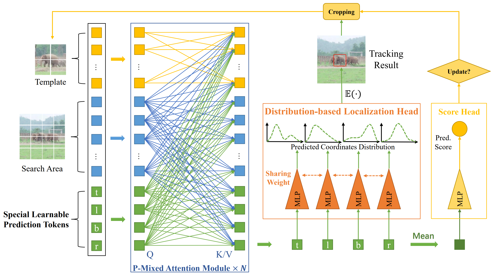
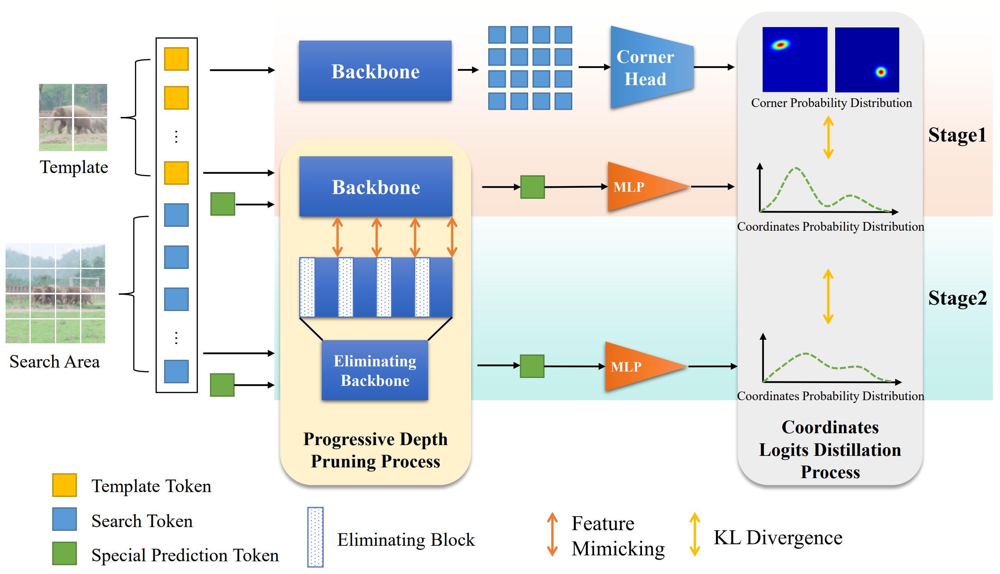

# MixFormerV2
The official implementation of the NeurIPS 2023 paper: [**MixFormerV2: Efficient Fully Transformer Tracking**](https://arxiv.org/abs/2305.15896).

## Model Framework


## Distillation Training Pipeline



## News

- **[Sep 22, 2023]** MixFormerV2 is accpeted by **NeurIPS 2023**! :tada:

- **[May 31, 2023]** We released two versions of the pretrained model, which can be accessed on [Google Driver](https://drive.google.com/drive/folders/1soQMZyvIcY7YrYrGdk6MCstTPlMXNd30?usp=sharing).

- **[May 26, 2023]** Code is available now!


## Highlights

### :sparkles: Efficient Fully Transformer Tracking Framework

MixFormerV2 is a well unified fully transformer tracking model, without any dense convolutional operation and complex score prediction module. We propose four key prediction tokens to capture the correlation between target template and search area.

### :sparkles: A New Distillation-based Model Reduction Paradigm

To further improve efficiency, we present a new distillation paradigm for tracking model, including dense-to-sparse stage and deep-to-shallow stage.

### :sparkles: Strong Performance and Fast Inference Speed

MixFormerV2 works well for different benchmarks and can achieve **70.6%** AUC on LaSOT and **57.4%** AUC on TNL2k, while keeping 165fps on GPU. To our best knowledge, MixFormerV2-S is the **first** transformer-based one-stream tracker which achieves real-time running on CPU.


## Install the environment
Use the Anaconda
``` bash
conda create -n mixformer2 python=3.6
conda activate mixformer2
bash install_requirements.sh
```

## Data Preparation
Put the tracking datasets in ./data. It should look like:
```
   ${MixFormerV2_ROOT}
    -- data
        -- lasot
            |-- airplane
            |-- basketball
            |-- bear
            ...
        -- got10k
            |-- test
            |-- train
            |-- val
        -- coco
            |-- annotations
            |-- train2017
        -- trackingnet
            |-- TRAIN_0
            |-- TRAIN_1
            ...
            |-- TRAIN_11
            |-- TEST
```

## Set project paths
Run the following command to set paths for this project
```
python tracking/create_default_local_file.py --workspace_dir . --data_dir ./data --save_dir .
```
After running this command, you can also modify paths by editing these two files
```
lib/train/admin/local.py  # paths about training
lib/test/evaluation/local.py  # paths about testing
```

## Train MixFormerV2

Training with multiple GPUs using DDP. 
You can follow instructions (in Chinese now) in [training.md](tutorials/training_zh.md).
Example scripts can be found in `tracking/train_mixformer.sh`.

``` bash
bash tracking/train_mixformer.sh
```

## Test and evaluate MixFormerV2 on benchmarks
- LaSOT/GOT10k-test/TrackingNet/OTB100/UAV123/TNL2k. More details of test settings can be found in `tracking/test_mixformer.sh`.

``` bash
bash tracking/test_mixformer.sh

```


## TODO
- [x] Progressive eliminating version of training.
- [ ] Fast version of test forwarding.

## Contant
Tianhui Song: 191098194@smail.nju.edu.cn

Yutao Cui: cuiyutao@smail.nju.edu.cn 


## Citiation
``` bibtex
@misc{mixformerv2,
      title={MixFormerV2: Efficient Fully Transformer Tracking}, 
      author={Yutao Cui and Tianhui Song and Gangshan Wu and Limin Wang},
      year={2023},
      eprint={2305.15896},
      archivePrefix={arXiv}
}
```
